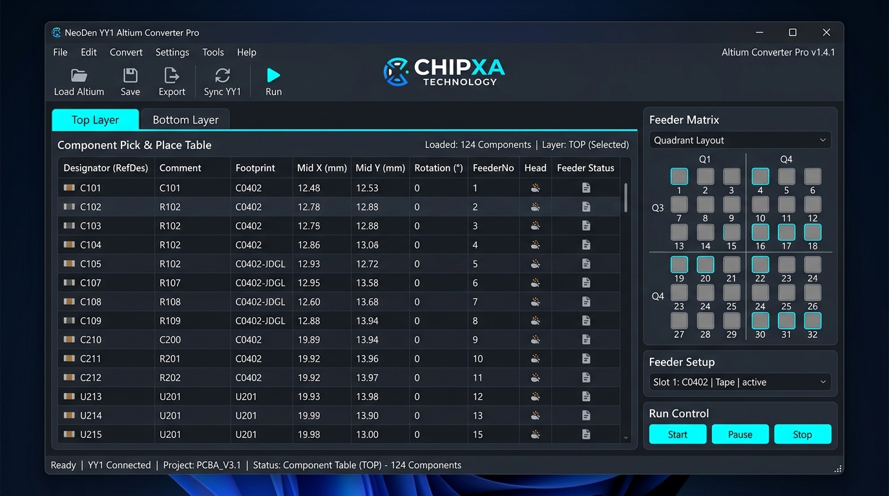
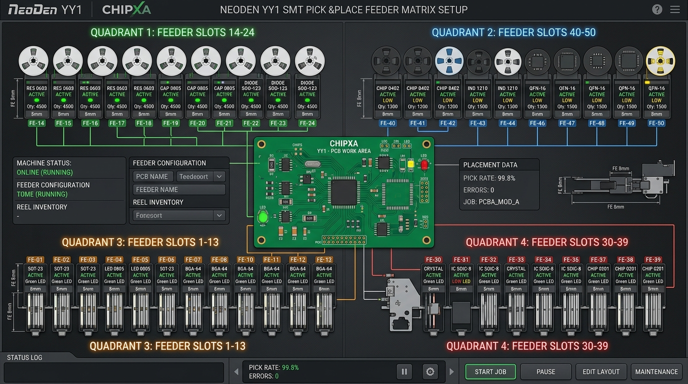

# NeoDen YY1 SMT - Altium Pick & Place File Converter (GUI Pro Suite)

**Đơn vị phát triển & Sở hữu bản quyền**: **CÔNG TY TNHH CÔNG NGHỆ CHIPXA**  
*Giải pháp phần mềm chuyển đổi & chuẩn hóa dữ liệu Pick & Place cho dây chuyền SMT NeoDen YY1*

---

## 📖 GIỚI THIỆU TỔNG QUAN

**NeoDen YY1 SMT Converter** là bộ phần mềm giao diện đồ họa (**Desktop GUI**) chuyên nghiệp, được thiết kế để giải quyết triệt để sự khác biệt định dạng giữa dữ liệu xuất từ phần mềm thiết kế mạch **Altium Designer** và định dạng tệp **CSV điều khiển chuẩn 13 cột** của máy gắp đặt linh kiện tự động **NeoDen YY1**.

Dự án cung cấp 4 phiên bản giao diện đa ngôn ngữ (**C++ Win32**, **Rust Native**, **Pure C Win32**, và **Python Tkinter**), tích hợp màn hình Intro chào mừng (*Splash Screen*), logo nhận diện thương hiệu CHIPXA, bảng chỉnh sửa tham số trực quan và hệ thống quản lý khay Feeder 4 góc thông minh.



---

## 🖥️ CÁC PHIÊN BẢN GIAO DIỆN & CÁCH KHỞI CHẠY

Người dùng có thể khởi chạy trực tiếp bằng cách **nhấp đúp chuột** vào file thực thi `.exe` hoặc file `.bat` tương ứng:

| Phiên bản GUI | Công nghệ | File chạy trực tiếp | Đặc điểm & Tính năng nổi bật |
| :--- | :---: | :--- | :--- |
| ⚡ **C++ GUI Pro**<br>*(Khuyên dùng)* | **C++ Win32 + GDI+** | 👉 **[`neoden_converter_gui.exe`](file:///c:/Users/Admin/Desktop/chipxa/Neoden-YY1/neoden_converter_gui.exe)**<br>*(hoặc [`1_CHAY_GIAO_DIEN_CHINH.bat`](file:///c:/Users/Admin/Desktop/chipxa/Neoden-YY1/1_CHAY_GIAO_DIEN_CHINH.bat))* | • Splash Screen mở đầu với Logo GDI+ & thanh Loading mượt mà.<br>• Giao diện Windows ListView hiệu năng cao, phản hồi tức thì.<br>• Tự động phân tách Tab Top / Bottom và sửa thông số trực tiếp. |
| 🎨 **Python GUI** | **Python 3 Tkinter** | 👉 **[`2_CHAY_GIAO_DIEN_PYTHON.bat`](file:///c:/Users/Admin/Desktop/chipxa/Neoden-YY1/2_CHAY_GIAO_DIEN_PYTHON.bat)** | • Giao diện Dark Theme hiện đại, tùy biến linh hoạt.<br>• Tích hợp đầy đủ ma trận 4 góc Feeder trực quan. |
| 🦀 **Rust Native GUI** | **Rust Win32 API** | 👉 **[`neoden_converter_rust_gui.exe`](file:///c:/Users/Admin/Desktop/chipxa/Neoden-YY1/neoden_converter_rust_gui.exe)**<br>*(hoặc [`3_CHAY_GIAO_DIEN_RUST.bat`](file:///c:/Users/Admin/Desktop/chipxa/Neoden-YY1/3_CHAY_GIAO_DIEN_RUST.bat))* | • 100% Rust an toàn bộ nhớ, không phụ thuộc DLL ngoài.<br>• Tốc độ mở cực nhanh, Splash Screen sắc nét. |
| 🚀 **C Native GUI** | **Pure C (C11) Win32** | 👉 **[`neoden_converter_c_gui.exe`](file:///c:/Users/Admin/Desktop/chipxa/Neoden-YY1/neoden_converter_c_gui.exe)**<br>*(hoặc [`4_CHAY_GIAO_DIEN_C.bat`](file:///c:/Users/Admin/Desktop/chipxa/Neoden-YY1/4_CHAY_GIAO_DIEN_C.bat))* | • Dung lượng siêu nhẹ chỉ **~128 KB**.<br>• Chạy mượt mà trên mọi phiên bản Windows (Windows 7/10/11). |

---

## 🚀 QUY TRÌNH SỬ DỤNG (4 BƯỚC NHANH CHÓNG)


1. **Bước 1: Nạp file Altium**: Nhấn nút **"📂 Chọn File Pick & Place (CSV)"** để mở tệp CSV xuất từ Altium. Phần mềm tự động đọc tọa độ Mid X/Y, Footprint, Comment, Layer (TopLayer/BottomLayer) và góc quay Rotation.
2. **Bước 2: Tự động ánh xạ Feeder**: Phần mềm đối chiếu danh sách linh kiện với Ma trận Feeder đã lưu để tự động điền số khay Feeder (1–50) và chọn đầu hút (Head 1 hoặc Head 2).
3. **Bước 3: Xem trước & Chỉnh sửa**: 
   - Chuyển đổi linh hoạt giữa 2 tab **Mặt TOP** và **Mặt BOTTOM**.
   - Nhấp đúp vào bất kỳ dòng linh kiện nào để tinh chỉnh nhanh tọa độ, góc quay, tốc độ gắp, chế độ nhận dạng Camera (Mode), hoặc bật cờ Bỏ qua (Skip).
4. **Bước 4: Xuất file chuẩn**: Nhấn nút **"💾 LƯU FILE CSV CHO MÁY YY1"** để xuất file kết quả. Nạp file này vào thẻ nhớ/USB của máy NeoDen YY1 để bắt đầu gắp mạch.

---

## 📐 ĐỊNH DẠNG DỮ LIỆU CHUẨN 13 CỘT MÁY NEODEN YY1

File kết quả được xuất chuẩn xác 100% theo quy cách của nhà sản xuất (đối chiếu chuẩn tệp mẫu [`0603Demo.csv`](file:///c:/Users/Admin/Desktop/chipxa/Neoden-YY1/0603Demo.csv)):

### 1. Khối Header máy NeoDen YY1
* `PanelizedPCB`: Thiết lập thông số ghép tấm mạch (UnitLength, UnitWidth, Rows, Columns).
* `Fiducial`: Tọa độ điểm dấu quang học chuẩn để máy căn chỉnh vị trí mạch.
* `NozzleChange`: Cấu hình tự động thay đổi đầu hút (Nozzle Station).

### 2. Bảng 13 Cột thông số linh kiện
| STT | Tên cột | Ý nghĩa kỹ thuật |
| :---: | :--- | :--- |
| **1** | `Designator` | Tên định danh linh kiện trên mạch (C1, R1, U1, LED1,...) |
| **2** | `Comment` | Giá trị hoặc mã linh kiện (100nF, 10K, STM32F103,...) |
| **3** | `Footprint` | Kích thước vỏ đóng gói (0603, 0805, LQFP-48, SOT-23,...) |
| **4** | `Mid X(mm)` | Tọa độ tâm X của linh kiện (đơn vị: mm) |
| **5** | `Mid Y(mm)` | Tọa độ tâm Y của linh kiện (đơn vị: mm) |
| **6** | `Rotation` | Góc quay đặt linh kiện (0° - 360°) |
| **7** | `Head` | Đầu hút gắp linh kiện (**1** hoặc **2**) |
| **8** | `FeederNo` | Vị trí khay nạp linh kiện tương ứng trên máy (**1 đến 50**) |
| **9** | `Mount Speed(%)` | Tốc độ dịch chuyển đầu gắp (mặc định: **100%**) |
| **10** | `Pick Height(mm)` | Độ cao khi hạ đầu hút để lấy linh kiện |
| **11** | `Place Height(mm)` | Độ cao khi hạ linh kiện xuống bề mặt bo mạch PCB |
| **12** | `Mode` | Chế độ chụp ảnh căn chỉnh Vision của máy (**0**: Không chụp, **1**: Chụp căn chỉnh nhanh, **2**: Căn chỉnh chính xác IC) |
| **13** | `Skip` | Bỏ qua không gắp linh kiện này (**Yes** / **No**) |

---

## 🎛️ BỐ CỤC MA TRẬN FEEDER 4 GÓC MÁY NEODEN YY1

Máy NeoDen YY1 bố trí 50 khay Feeder tại 4 góc làm việc vật lý:

```text
┌────────────────────────────────────────────────────────┐
│  [Góc Trên Trái]                      [Góc Trên Phải]  │
│  Khay Feeder: 14 -> 24 (11 khay)      Khay Feeder: 40 -> 50 (11 khay) │
│                                                        │
│                     KHÔNG GIAN MẠCH PCB                │
│                                                        │
│  [Góc Dưới Trái]                      [Góc Dưới Phải]  │
│  Khay Feeder: 1 -> 13 (13 khay)       Khay Feeder: 30 -> 39 (10 khay) │
└────────────────────────────────────────────────────────┘
```

* **Lưu ma trận hiện hành**: Lưu vào file [`feeder_matrix.json`](file:///c:/Users/Admin/Desktop/chipxa/Neoden-YY1/feeder_matrix.json) để tự động ghi nhớ cấu hình khi tắt mở phần mềm.
* **Quản lý Profile theo loại bo mạch**: Lưu trong thư mục [`feeder_profiles/`](file:///c:/Users/Admin/Desktop/chipxa/Neoden-YY1/feeder_profiles) (ví dụ: `Bo_LED_Chieu_Sang.json`, `Bo_MCU_Dieu_Khien.json`, `Bo_Nguon_Power.json`, `Mac_Dinh.json`).



---

## 📁 CẤU TRÚC THƯ MỤC DỰ ÁN

```text
Neoden-YY1/
├── assets/
│   ├── app_icon.ico               # Icon ứng dụng Windows
│   ├── logo.png                   # Logo CHIPXA hiển thị trên Splash Screen & GUI
│   ├── neoden_gui_overview.jpg    # Ảnh chụp giao diện tổng quan phần mềm
│   └── feeder_matrix_setup.jpg    # Sơ đồ ma trận khay Feeder 4 góc
│
├── feeder_profiles/               # Danh mục các Profile cấu hình Feeder đã lưu
│   ├── Bo_LED_Chieu_Sang.json
│   ├── Bo_MCU_Dieu_Khien.json
│   ├── Bo_Nguon_Power.json
│   ├── Mac_Dinh.json
│   └── Nguon_Power_Board.json
│
├── feeder_matrix.json             # Cấu hình ma trận 50 khay Feeder hiện tại
│
├── cpp/                           # ⚡ MÃ NGUỒN C++ WIN32 GUI
│   ├── gui_main.cpp               # Giao diện Win32 + Splash Screen GDI+
│   ├── converter.hpp / .cpp       # Bộ xử lý dữ liệu Pick & Place
│   ├── app.rc / app_icon.ico      # Tài nguyên nhúng Icon
│   └── CMakeLists.txt             # Cấu hình build CMake C++
│
├── c/                             # 🚀 MÃ NGUỒN PURE C WIN32 GUI
│   ├── gui_main.c                 # Giao diện C thuần Win32 API
│   ├── converter.h / .c           # Thuật toán phân tích & xử lý CSV
│   ├── app.rc / app_icon.ico      # Tài nguyên nhúng Icon
│   └── CMakeLists.txt             # Cấu hình build CMake C
│
├── rust/                          # 🦀 MÃ NGUỒN RUST NATIVE GUI
│   ├── src/main.rs                # Giao diện Win32 viết bằng Rust thuần
│   ├── build.rs                   # Build script nhúng Resource Icon
│   ├── app.rc / app_icon.ico      # Tài nguyên Icon
│   ├── Cargo.toml / Cargo.lock    # Cấu hình dự án Rust Cargo
│   └── .gitignore
│
├── app_gui.py                     # Ứng dụng Python GUI (Tkinter)
├── neoden_converter_gui.exe       # File thực thi C++ GUI Pro (Khuyên dùng)
├── neoden_converter_rust_gui.exe  # File thực thi Rust Native GUI
├── neoden_converter_c_gui.exe     # File thực thi Pure C GUI
├── 1_CHAY_GIAO_DIEN_CHINH.bat     # Khởi chạy bản C++ GUI Pro
├── 2_CHAY_GIAO_DIEN_PYTHON.bat    # Khởi chạy bản Python Tkinter GUI
├── 3_CHAY_GIAO_DIEN_RUST.bat      # Khởi chạy bản Rust Native GUI
├── 4_CHAY_GIAO_DIEN_C.bat         # Khởi chạy bản Pure C GUI
├── 0603Demo.csv                   # File CSV mẫu gốc từ nhà sản xuất NeoDen YY1
├── MainPCB.csv                    # File Altium Pick & Place mẫu thử nghiệm
├── Pick Place for MainPCB.csv     # File Altium Pick & Place đầy đủ
├── SMT NEODEN/                    # Sách cẩm nang HDSD thiết bị SMT (YY1, FP2636, IN6)
├── .gitignore
└── README.md                      # Tài liệu hướng dẫn kỹ thuật
```

---

## 🛠️ HƯỚNG DẪN BIÊN DỊCH TỪ MÃ NGUỒN (BUILD INSTRUCTIONS)

Nếu bạn muốn tự chỉnh sửa mã nguồn và biên dịch lại các file `.exe`:

### 1. Biên dịch C++ GUI (`cpp/`)
Yêu cầu: **Visual Studio C++ (MSVC)** hoặc **CMake**:
```powershell
cd cpp
mkdir build
cd build
cmake ..
cmake --build . --config Release
copy Release\neoden_converter_gui.exe ..\..\neoden_converter_gui.exe
```

### 2. Biên dịch C GUI (`c/`)
```powershell
cd c
mkdir build
cd build
cmake ..
cmake --build . --config Release
copy Release\neoden_converter_c_gui.exe ..\..\neoden_converter_c_gui.exe
```

### 3. Biên dịch Rust GUI (`rust/`)
Yêu cầu: **Rust & Cargo**:
```powershell
cd rust
cargo build --release
copy target\release\rust.exe ..\neoden_converter_rust_gui.exe
```

### 4. Chạy Python GUI
Yêu cầu: **Python 3.x**:
```powershell
py app_gui.py
```

---

## 📚 TÀI LIỆU HƯỚNG DẪN THIẾT BỊ SMT ĐÍNH KÈM

Trong thư mục [`SMT NEODEN/`](file:///c:/Users/Admin/Desktop/chipxa/Neoden-YY1/SMT%20NEODEN) có sẵn tài liệu hướng dẫn sử dụng thiết bị SMT bản Song ngữ (Tiếng Anh & Tiếng Việt):
1. **NeoDen YY1 Pick and Place Machine**: Sách HDSD máy gắp linh kiện tự động.
2. **NeoDen FP2636 Stencil Printer**: Sách HDSD máy in kem hàn thiếc.
3. **NeoDen IN6 Reflow Oven**: Sách HDSD lò hàn cuộn hồng ngoại 6 vùng nhiệt.

---

## 🏢 BẢN QUYỀN & THÔNG TIN DOANH NGHIỆP

* **Tên doanh nghiệp**: **CÔNG TY TNHH CÔNG NGHỆ CHIPXA**
* **Lĩnh vực**: Nghiên cứu, thiết kế phần cứng điện tử, lập trình nhúng & tự động hóa dây chuyền SMT.
* **Bản quyền phần mềm**: Mọi quyền được bảo hộ bởi CÔNG TY TNHH CÔNG NGHỆ CHIPXA.
